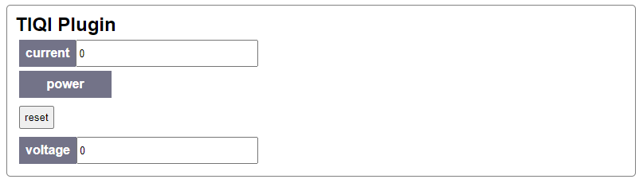

# Slapdash

**<https://github.com/cathaychris/slapdash/>**

The Slapdash library lets you create a control dashboard with ease. It takes device driver classes written in simple python and automatically generates

- A web server exposing the class via a RESTful API, that can be accessed with HTTP requests or using the provided clients;
- An automatically generated fronted rendered in a web page that directly connects to the web server for immediate access;
- and modularly permits the bootstrapping of other interfaces such as RPC. Bring-Your-Own-Interface.

For example, it will turn this:

```python
class Device:

    _current = 0.0
    _voltage = 0.0
    _power = False

    @property
    def current(self):
        # run code to get current
        return self._current

    @current.setter
    def current(self, value):
        # run code to set current
        self._current = value

    @property
    def voltage(self):
        # run code to get voltage
        return self._voltage

    @voltage.setter
    def voltage(self, value):
        # run code to set voltage
        self._voltage = value

    @property
    def power(self):
        # run code to get power state
        return self._power

    @power.setter
    def power(self, value):
        # run code to set power state
        self._power = value

    def reset(self):
        self.current = 0.0
        self.voltage = 0.0
```

into this:



Try running this example with

```python
from slapdash.examples import run_example
run_example('doc_example')
```

# Installation

Slapdash requires Python 3.10 or newer.

```bash
pip install git+https://github.com/cathaychris/slapdash
```

# Development

The development environment is managed with [pixi](https://pixi.sh):

```bash
pixi run test             # run the test suite
pixi run lint             # run ruff
pixi run -e docs docs     # serve the documentation locally
pixi run frontend-build   # rebuild the web frontend into slapdash/frontend
pixi run examples         # list the bundled examples
```

Tests can also be run against the oldest and newest supported Python with `pixi run -e test-py310 test` and `pixi run -e test-py313 test`.

# Credits

Slapdash was developed in the [TIQI group](https://tiqi.ethz.ch/) at ETH Zürich, primarily by [Matt Grau](https://www.odu.edu/directory/matt-grau).
