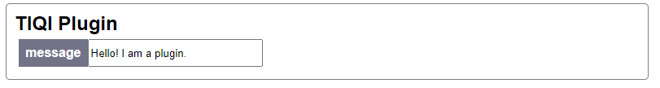

# Installation

## Requirements

slapdash requires Python 3.10+ because it uses type annotations and [FastAPI](https://fastapi.tiangolo.com/) and [Starlette](https://www.starlette.io/) to generate the web backend.

## Install

Install slapdash into your project's environment, e.g. with `pip`:

```bash
pip install git+https://github.com/cathaychris/slapdash
```

or by adding it as a PyPI/git dependency of your `pixi`, `uv` or `poetry` project. slapdash only declares lower bounds for its dependencies, so it can be combined with other packages using recent versions of FastAPI, uvicorn and python-socketio. Optional packages used in the examples can be installed with the `examples` extra (`slapdash[examples]`).

## Development

slapdash is developed with [pixi](https://pixi.sh), which manages the Python environments as well as Node.js for the frontend. After cloning the repository:

```bash
pixi run test                   # run the tests (default environment, latest Python)
pixi run -e test-py310 test     # run the tests on the oldest supported Python
pixi run lint                   # lint with ruff
pixi run -e docs docs           # serve these docs at http://localhost:8000
pixi run frontend-build         # install npm packages and build the frontend
pixi run frontend-dev           # rebuild the frontend on changes
```

The frontend sources are in `./frontend`; the build is written to `./slapdash/frontend`, which is served by the Python package, so commit the built files after changing the frontend. While developing the frontend, run `pixi run frontend-dev` alongside a dashboard on port 8000 (e.g. `pixi run python -m slapdash.examples hello_world`) and reload http://localhost:8000 after changes. Run `pixi run frontend-build` before committing, as the development build is not minified.

### Releasing

1. Bump `__version__` in `slapdash/version.py` (semantic versioning; note that clients refuse servers with a different major version) and merge it to `main`.
2. Create a GitHub release from `main` with the tag `v<version>`, e.g. `v1.1.0`.
3. The `publish` workflow checks that the tag matches the version, builds and tests the package, and uploads it to PyPI via trusted publishing.

## Examples

Run

```bash
python -m slapdash.examples
```

to see a list of the available examples and run them. Try `python -m slapdash.examples hello_world`. You should see

```bash
INFO:     Started server process [10257]
INFO:     Waiting for application startup.
INFO:     Application startup complete.
INFO:     Uvicorn running on http://0.0.0.0:8000 (Press CTRL+C to quit)
```

And if you open http://localhost:8000 with a browser you should be greeted by the automatically generated frontend.

